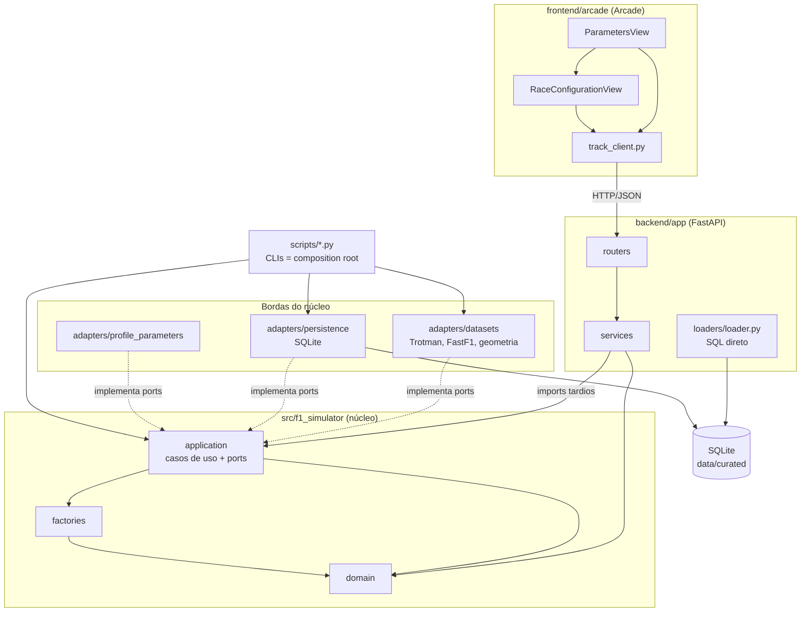
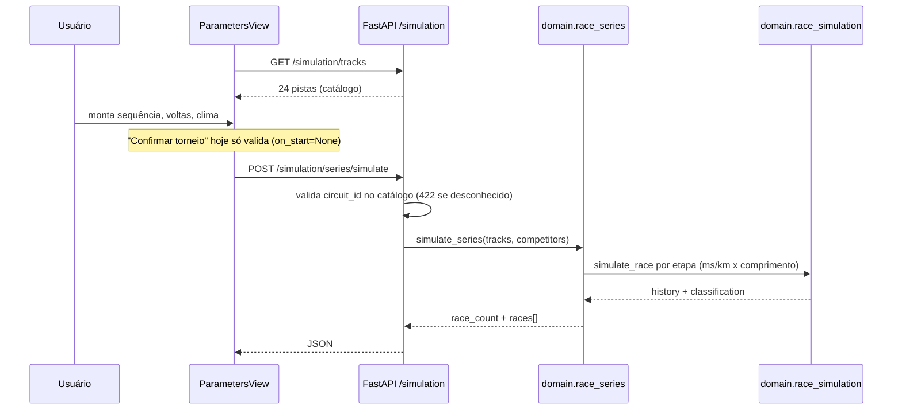
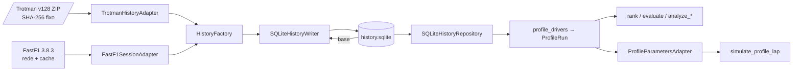

# Codebase Map

> Gerado pelo Cartographer em 2026-09-25T20:01:29Z, sobre o commit `e86fe24`
> (branch `63-modelagem-pneus`, já com a `develop` incorporada).
> Contagem de tokens **estimada** (bytes ÷ 4, sem CSV, binários e `uv.lock`), porque
> `tiktoken` não estava instalado. Este arquivo é um índice de navegação: em caso
> de divergência, valem `AGENTS.md`, `CONTRIBUTING.md`, os ADRs em `docs/adr/` e o código.

## 1. Visão geral

Simulador de Fórmula 1 da disciplina MC857 (Unicamp). Um núcleo Python determinístico
(`src/f1_simulator`) contém domínio e casos de uso. As bordas são:

- **frontend desktop** em Arcade (`frontend/arcade`), que só fala HTTP com o backend;
- **backend FastAPI** (`backend/app`), que traduz HTTP para o núcleo;
- **ETL e datasets** (`scripts/`, `adapters/`), que ingerem o Trotman v128 (Kaggle, CC0) e
  enriquecem com o FastF1 3.8.3 offline;
- **persistência SQLite** (`adapters/persistence`).

O que existe **hoje** e o que não existe:

| Área | Estado |
|---|---|
| Motor de corrida | Mínimo: **ritmo constante** por piloto (`domain/race_simulation.py`). Clima, pit, pneus e tráfego ainda **não** alteram o resultado. |
| Sequência de corridas livres | Implementada (ADR 0006): `POST /simulation/series/simulate`. Cada etapa tem classificação independente, sem pontuação de campeonato. |
| Frontend | Telas de torneio, configuração de sessão e clima. "Confirmar torneio" **só valida**; ainda não chama o backend para simular. |
| Perfis de pilotos | Estudos offline completos (ritmo por contexto, ranking, companheiros, avaliação entre eventos). Um adaptador alimenta o experimento de **uma volta**; o motor da corrida completa ainda não usa perfis. |
| Pneus | Estudos exploratórios (#63): tendências por stint, janelas de relargada, SC/VSC, comparação de estimadores. **Nenhum coeficiente foi exportado ao núcleo.** |

## 2. Arquitetura



Regras estruturais (ADR 0002, `AGENTS.md`):

- `domain/` só importa `domain/`. Sem I/O, sem framework, sem SQLite.
- `application/` nunca importa SQLite, FastF1 nem CSV; isso é papel das bordas.
- **Adapter** normaliza formatos externos para DTOs; **Factory** constrói objetos válidos.
  Os dois se referenciam, mas não formam ciclo porque os DTOs em `application/*_dto.py`
  são módulos-folha.
- Ports são `typing.Protocol`, em `application/ports/`.
- `arcade.View`, widgets e estado da janela **não** são fonte de verdade da simulação.
- Aleatoriedade e dependências externas são injetáveis; simulações reproduzíveis por semente.

## 3. Estrutura de diretórios

```
.
├── AGENTS.md, CONTRIBUTING.md, README.MD, proposta.md
├── Desenvolvimento de Simulador F1.md   # escopo, fases, restrições do produto
├── pyproject.toml, uv.lock, requirements-etl.txt, .python-version (3.12)
├── run.py                # sobe docker compose, espera backend, abre o frontend
├── docker-compose.yaml   # só o backend (porta 8000)
├── backend/              # FastAPI (app/{routers,services,loaders,models,schemas}), Dockerfile, entrypoint.sh
├── frontend/arcade/      # cliente desktop Arcade + assets/
├── src/f1_simulator/     # núcleo hexagonal
│   ├── domain/           # entidades, esquemas, regras de perfil e simulação
│   ├── application/      # casos de uso, DTOs, ports/
│   ├── factories/        # validação e construção de objetos canônicos
│   └── adapters/         # datasets/ (Trotman, FastF1, geometria), persistence/ (SQLite), profile_parameters.py
├── scripts/              # CLIs de ETL, perfis, pneus, sync do backlog
├── configs/              # planos de avaliação congelados (JSON)
├── data/                 # sources/ (manifestos versionados); raw/, curated/, geometry/ são gitignored
├── tests/                # unittest/pytest + fixtures/ (Trotman e geometria)
├── docs/                 # ADRs, modelagem, ETL, backlog.md (espelho gerado), progresso.md
├── TOBEDEFINED/          # protótipo órfão (pista oval, RaceState); fora do pytest
└── .github/workflows/    # pull-request-rules.yml, sync-backlog.yml
```

## 4. Guia de módulos

### 4.1 `src/f1_simulator/domain/`

Convenções: dataclasses `frozen`, tuplas em vez de listas, unidades nos nomes (`_ms`, `_m`,
`_pct`, `_deg`, `_kmh`), ausência é `None` e **nunca zero**.

| Módulo | Propósito | Pontos de atenção |
|---|---|---|
| `race_data.py` | Agregado `RaceData` (circuito, corrida, pilotos, times, entradas, voltas, pits, `SourceId`, geometria opcional). IDs como `race:1141`, `driver:830`. | Geometria é opcional; nunca se infere traçado a partir de lat/long. |
| `track_geometry.py` | `TrackGeometry`, `TrackPoint`, `PitLanePoint`, `GeometryProvenance`. | X/Y **normalizados, sem unidade**; só `cumulative_distance_m` está em metros. |
| `race_simulation.py` | `Competitor`, `simulate_race(competitors, total_laps)`. **Fonte de verdade da classificação.** | Ordena por `(tempo acumulado, driver_id)`. Sem aleatoriedade, pneus, pit, abandono. `total_time_ms` arredondado a 0,1 ms só na saída. |
| `race_series.py` | `SeriesTrack`, `SeriesCompetitor`, `simulate_series`. | Tempo de volta = `round(pace_ms_per_km * lap_length_m / 1000, 1)`. Corridas independentes. |
| `driver_parameters.py` | `DriverPaceParameters`, `deterministic_lap_time`. | `variability_mode` só `"disabled"`. Arredonda **uma vez** com `ROUND_HALF_UP`. MAD e bootstrap não entram no tempo (evita contar carro duas vezes). |
| `driver_profile.py` | `METHOD_VERSION = "contextual-pace-v1"`, `ProfileConfig`, `PaceContext`, `assess_session`, `estimate_profiles`. | `ProfileConfig` não tem defaults. Cada volta é auditada com todas as razões de exclusão. Consistência é MAD, não sigma. |
| `context_sensitivity.py` | `ContextVariant`, `separate_stints`. | Reagrupamento exploratório; nunca relaxa exclusões de qualidade. |
| `profile_evaluation.py` | `EvaluationPlan`, `compare_profiles` (`profile-stability-v1`). | Estabilidade **em pp** entre eventos, não erro de predição. |
| `profile_reliability.py` | `BootstrapConfig(2000, 42, 0.95, 5)`, `profile_support`. | Reamostra **eventos**, não voltas. |
| `teammates.py` | `compare_teammates`, `context_reference` (`observed_context_field_median_v1`). | Gap simétrico `200*(a-b)/(a+b)`; trocar de equipe cria outro par. |
| `history.py` | Esquema tabular das 14 tabelas do Trotman (`HISTORY_SCHEMA`), `HistoricalRecord`. | `race_results` tem chave `result_id`; `laps` tem `record_number` (admite duplicatas). |
| `session_data.py` | Esquema das 10 tabelas de sessão FastF1 (`SESSION_SCHEMA`). | Relógios brutos separados, sem interpolação. |

### 4.2 `src/f1_simulator/application/`

**DTOs:** `race_data_dto.py` (`NormalizedRaceData`), `track_geometry_dto.py`.

**Ports** (`ports/`): `race_data.py` (`RaceDatasetPort`, `RaceDataWriterPort`, `RaceDataRepository`),
`track_geometry.py`, `history.py` (`HistoryDataset`, `HistoryWriter`, `HistoryRepository`),
`driver_parameters.py` (`DriverParametersProvider`).

| Caso de uso | O que faz |
|---|---|
| `race_data_ingestion.py` | `RaceDataIngestionService`: junção Adapter → Factory. |
| `etl.py` | `run_race_etl(...)`: ETL de uma corrida para SQLite mais relatório de qualidade. Geometria é opt-in; se pedida e inválida, **falha** (sem fallback). |
| `history_etl.py` | `run_history_etl(...)`: histórico completo em streaming; publica só se tudo validar. |
| `simulate_profile_lap.py` | Experimento de uma volta com um `DriverParametersProvider`. |
| `profile_drivers.py` | `ProfileRun`; só sessões `R`, com proveniência de ETL. |
| `rank_drivers.py` | Ranking de competição (1, 1, 3); indisponíveis no fim. |
| `evaluate_profiles.py`, `analyze_contexts.py`, `analyze_development.py`, `analyze_teammates.py` | Avaliações e sensibilidades. `analyze_development` **nunca lê** as sessões de validação reservadas. |
| `analyze_tyres.py`, `analyze_tyre_restarts.py`, `compare_tyre_estimators.py` | Estudos de pneus (#63), descritivos, sem coeficientes de motor. |

### 4.3 `src/f1_simulator/factories/`

- `race_data_factory.py`: `RaceDataFactory.create` valida unicidades, referências e faixas; tipos exatos (bool não passa como int).
- `track_geometry_factory.py`: exige pista **fechada**, sequência contígua, progresso estritamente crescente e **exatamente um** ponto de serviço no pit.
- `history_factory.py`: campos exatamente os do esquema; `datetime` exige fuso; chaves e referências cruzadas são verificadas pelo writer na transação.

### 4.4 `src/f1_simulator/adapters/`

| Arquivo | Papel |
|---|---|
| `datasets/trotman_source.py` | Identidade imutável do dataset: v128 e SHA-256 do ZIP. |
| `datasets/acquisition.py` | `download_verified`: download atômico, idempotente por checksum. |
| `datasets/trotman.py` | `TrotmanDatasetAdapter`: uma corrida (8 CSVs) para `NormalizedRaceData`. Confere o SHA do ZIP. |
| `datasets/trotman_history.py` | `TrotmanHistoryAdapter`: 14 CSVs; contrato de colunas **exato**; ids com prefixo (`race:1141`). |
| `datasets/fastf1_sessions.py` | `FastF1SessionAdapter`: sessões 2018+, `fastf1==3.8.3` exato; única função com rede é `load_session`. |
| `datasets/mock_track_geometry.py` | Geometria reduzida (CSV + manifestos JSON com SHA-256), sem pandas/FastF1. |
| `persistence/sqlite_history.py` | `SQLiteHistoryWriter` (publicação atômica, enriquecimento idempotente por sessão) e `SQLiteHistoryRepository`. |
| `persistence/sqlite_race_data.py` | Escreve o SQLite de **uma corrida** (esquema enxuto). |
| `persistence/sqlite_race_data_repository.py` | Lê ambos os formatos (via views `race_entries` e `source_ids`). |
| `persistence/sqlite_track_geometry.py` | Geometria dentro do mesmo banco da corrida. |
| `profile_parameters.py` | `ProfileParametersAdapter`: `ProfileRun` → parâmetros por contexto exato. |

### 4.4.1 `scripts/` (composition roots das CLIs)

- **ETL:** `download_trotman.py`, `list_races.py`, `ingest_trotman.py` (`--race-id` ou `--all-tables`), `ingest_fastf1.py` (`--base`, `--season`, `--rounds`, `--sessions`, `--strict`, `--without-telemetry`).
- **Pilotos:** `profile_drivers.py`, `rank_drivers.py`, `evaluate_profiles.py`, `analyze_profile_development.py`, `analyze_profile_contexts.py`, `analyze_teammates.py`.
- **Pneus:** `analyze_tyres.py`, `analyze_tyre_restarts.py`, `compare_tyre_estimators.py`.
- **Manutenção:** `sync_github_backlog.py` (gera `docs/backlog.md`; requer `gh` autenticado).
- Todos inserem `src/` no `sys.path`. Resultados são publicados em pasta nova com sufixo uuid (rename atômico), nunca sobrescrevem, e recusam escrever em `data/raw`.

### 4.5 `backend/app/`

| Arquivo | Papel |
|---|---|
| `main.py` | FastAPI; routers `health`, `etl`, `history`, `simulation`; CORS `*`. |
| `config.py` | Caminhos fixos no container (`/data/curated/...`); não lê variáveis de ambiente. |
| `routers/simulation.py` | Rotas de simulação, catálogo e geometria. |
| `services/track_geometry.py` | Catálogo de pistas (manifesto) e geometria. Independe do ETL carregado. |
| `services/race_curation.py` | `POST /load`: ETL da corrida; se a geometria falhar, repete **sem** geometria. |
| `services/race_simulation.py` | Simula a corrida corrente e grava `backend/races/race.json`. |
| `loaders/loader.py` | SQL direto no SQLite (`mode=ro`), **fora dos ports**. `base_lap_time_ms` = mediana do quartil mais rápido. |
| `models/models.py` | `DriverParameters` do backend (**diferente** de `domain.DriverPaceParameters`). |
| `services/errors.py` | `ETLError` com `reason` → status (validation 422, source 404, storage 500). |

**Rotas:**

| Método | Caminho | Observação |
|---|---|---|
| GET | `/` | Health; usado pelo polling do `run.py`. |
| GET | `/api/etl/{tables,schema/{t},preview/{t},table/{t},database/dump}` | Inspeção de `current-race.sqlite`; `table` e `dump` sem paginação. |
| POST | `/api/history/build` | Roda `run_history_etl` (`overwrite=True`). |
| GET | `/api/history/{tables,schema/{t},preview/{t},reports}` | Inspeção de `history.sqlite`. |
| GET | `/simulation/races` | Catálogo (`races-index.json`). |
| POST | `/simulation/load` | `{race_id}`; ETL para `current-race.sqlite`. |
| POST | `/simulation/simulate` | Simula a corrida corrente; grava `race.json`. |
| GET | `/simulation/{race,drivers,details}` | Resultado, parâmetros e resumo da corrente. `race` dá 404 antes de simular. |
| POST | `/simulation/series/simulate` | Série de corridas livres (ADR 0006). Nome e comprimento vêm do **catálogo**, nunca do cliente. |
| GET | `/simulation/tracks` | Catálogo de 24 pistas. |
| GET | `/simulation/track/{circuit_id}` | Geometria; aceita `circuit:18` ou `18`. |

### 4.6 `frontend/arcade/`

Entrada: `python -m frontend.arcade` (`__main__.py`). O frontend **não importa** `f1_simulator`.

| Arquivo | Papel |
|---|---|
| `parameters_view.py` | Tela inicial "Configuração do torneio" (~1470 linhas): catálogo de pistas, sequência com drag-and-drop, regras. Callback `on_start` é `None` no `__main__`. |
| `race_configuration_view.py` | Configuração por corrida. Abas **Sessão** e **Clima** funcionais; Pista, Regras e Carros são placeholders. |
| `configuration_state.py` | Dados e validação puros: `WeatherSchedule`, `TournamentRules`, `SessionConfiguration`, `ConfigurationFormData`, `SimulationPlan`. |
| `configuration_layout.py`, `track_preview.py` | Geometria pura, sem Arcade. |
| `track_client.py` | HTTP com `urllib` (`BASE_URL = http://localhost:8000`); só GET. |
| `weather_view.py` | `TrackConfigurationView`, tela **legada** 1280x720, inalcançável no fluxo atual (só constantes e helpers reaproveitados). |
| `track_view.py` | Protótipo isolado de replay; `fetch` síncrono; sem testes. |
| `theme.py` | Cores. |

### 4.7 `tests/`

- Execução: `python3 -m unittest -v` (a partir da raiz) ou `pytest` (`testpaths=["tests"]`).
- Testes de GUI exigem `ARCADE_GUI_TEST=True` e OpenGL; ficam pulados por padrão.
- Nenhum teste acessa a rede (FastF1 é sintético; download simulado com `file://`).
- Fixtures: `trotman_v128_history/` (corrida 1141, 14 CSVs), `trotman_v128_sample/`, `trotman_v128_tracks_2025/` (24 pistas x 240 pontos; pit lane 24 x 80).
- **Helpers compartilhados** (acoplamento implícito): `history_support.py`, e exports de `test_driver_profile.py` (`CONFIG`, `record`, `lap`), `test_profile_evaluation.py` (`MemoryHistory`, `plan`), `test_tyres.py` (`rows`). Mudar esses módulos pode quebrar vários outros.

## 5. Fluxos de dados

### 5.1 Corrida livre em sequência (fluxo da UI atual)



### 5.2 ETL (offline, sem HTTP entre os componentes)



Passos: `download_trotman.py` → `ingest_trotman.py --all-tables` → `ingest_fastf1.py --base ...` →
consumo por `SQLiteHistoryRepository`. O modo `--race-id` gera outro SQLite (esquema enxuto,
com `race_entries` como tabela real) usado pelo backend.

### 5.3 Corrida histórica no backend

`POST /simulation/load` → `run_race_etl(TrotmanDatasetAdapter, SQLiteRaceDataWriter, ...)` →
`current-race.sqlite` → `POST /simulation/simulate` → `loader.load_driver_parameters` (SQL direto) →
`Competitor` → `simulate_race` → `race.json` → `GET /simulation/race`.

## 6. Convenções

- **Idioma:** código, docstrings, mensagens e docs em português; identificadores em inglês.
- **IDs canônicos:** `entidade:<id_externo>` (`race:1124`, `driver:842`, `circuit:7`, `session:<raceId>:R`).
- **Unidades no nome** e convertidas na ingestão; tempos em ms inteiros; `\N` do Trotman vira `None`.
- **Ausência nunca é zero.** Perfis indisponíveis carregam `unavailable_reason`.
- **Escritas atômicas:** arquivo temporário no mesmo diretório e `os.replace` / `os.link`.
- **Versionamento explícito** de métodos (`contextual-pace-v1`, `profile-stability-v1`, `context-reliability-v1`) e hashes (`*_sha256`) para reprodutibilidade.
- **Aleatoriedade:** só `Random(seed)` local em estatística (bootstrap, semente 42). O simulador é 100% determinístico.
- **Commits:** `tipo(escopo): resumo` no imperativo; só com autorização do usuário.
- **Backlog:** GitHub Issues é a fonte; `docs/backlog.md` é espelho gerado e **nunca se edita à mão**. Fallback: `docs/progresso.md`.
- **PRs:** só `develop` pode virar PR para `main` (workflow `pull-request-rules.yml`).

## 7. Gotchas

**Divergências entre docs e código**

1. `docs/planejamento-modelagem.md`, `contrato-perfil-simulacao.md`, `ranking-e-adaptador-pilotos.md` e `modelagem-pneus-inicial.md` citam `backend/app/engine/simulation.py`, `frontend/arcade/oval_track.py` e `race_view.py` como existentes. **Não existem nesses caminhos.** O motor está em `src/f1_simulator/domain/race_simulation.py`; os protótipos de pista oval estão em `TOBEDEFINED/`.
2. `README.MD` manda rodar `python -m frontend.arcade.race_view`, módulo inexistente.
3. `pyproject.toml` declara `simulador = "main:main"`, sem `main.py` na raiz. `pipenv` é citado em docs, mas não há `Pipfile`.
4. `TOBEDEFINED/*` importa `frontend.arcade.oval_track` e `race_state`, que só existem ali; nada executa. Excluído do pytest por `norecursedirs`.
5. ADR 0001 e 0002 ainda mencionam Django no corpo; o ADR 0004 (FastAPI) o substitui.
6. As 6 sessões de validação de 2024 **já foram examinadas** (18/09/2026). `configs/profile-validation-decision-2024.json` registra `reserved_metrics_examined=false` apenas para o momento em que foi escrito. Não tratar a reserva como inédita.
7. `pyproject.toml` só lista dependências do frontend; as do backend estão em `backend/requirements.txt`. O pacote `f1_simulator` não é instalado (`PYTHONPATH=src`).

**Comportamento não óbvio**

- **Dois caminhos de parâmetros** que não se conversam: série livre (ms/km, request) e corrida histórica (`loader.py`). Nenhum usa ainda `DriverParametersProvider` nem os perfis.
- **Backend fora dos ports:** `loader.py` e `services/` acessam SQLite direto, sem `RaceDataRepository`.
- **`GET /simulation/drivers`** devolve `race_id=0` fixo. `POST /simulation/load` com erro devolve `{"detail": {...}}`, não exatamente o `RaceLoadErrorResponse` declarado.
- **Manifesto com `circuit_name` ou `lap_length_m` nulos:** nome vazio dá 422, mas `isfinite(None)` provoca `TypeError` (500).
- **Geometria vem de fixture de teste:** o compose monta `tests/fixtures/trotman_v128_tracks_2025` sobre `/data/geometry` (gitignored). Geometria 2025 não é layout verificado de outra temporada. Selecionar geometria não amplia o suporte do motor a todos os circuitos.
- **`run.py`** espera no máximo 15 s pelo backend; o `entrypoint.sh` pode baixar o dataset no primeiro boot e estourar esse tempo. Falhas de download no entrypoint viram só aviso.
- **Docker:** os binds sobrescrevem o `COPY` da imagem; o código é sempre o do host.
- **Duas variantes de SQLite:** modo `--race-id` (esquema enxuto) e `--all-tables` (histórico). `ingest_fastf1` só aceita o histórico. `SQLiteRaceDataRepository` lê ambos; `SQLiteHistoryRepository.get_race` **recusa** corridas com carro compartilhado ou volta duplicada.
- **Valores fixos no código:** `rank_drivers.py` e `analyze_tyre_restarts.py` citam "18 eventos" nos gráficos; `analyze_tyre_restarts.py` tem sessões e pilotos fixos; `compare_tyre_estimators.interval` fixa seed 42 e 2000 réplicas.
- **Frontend:** `_OPENER` de `track_client.py` é criado no import, na thread da UI, para evitar `ssl.SSLError` no Fedora/Pyglet. `ParametersView` desenha em canvas lógico 1280x720 numa janela 1672x900. Pistas repetidas compartilham configuração por `circuit_id`.
- **Testes de GUI** usam coordenadas fixas; ajustes de layout em `parameters_view.py` ou `race_configuration_view.py` os quebram.
- **CI:** não há CI de testes, lint ou tipos; só a regra de branch de origem e o sync manual do backlog (que faz push direto no branch default).
- **Licenças:** Trotman é CC0. O software do FastF1 é MIT, mas os **dados** dele seguem os termos do upstream. Dados brutos, telemetria e bancos completos ficam fora do Git.

## 8. Guia de navegação

| Para... | Toque em |
|---|---|
| Adicionar uma tabela ao histórico | `domain/history.py` (esquema) → `adapters/datasets/trotman_history.py` (`MAPPINGS`) → testes em `test_history_etl.py` |
| Adicionar um feed FastF1 | `domain/session_data.py` → `adapters/datasets/fastf1_sessions.py` → `sqlite_history.py` |
| Novo endpoint | `backend/app/routers/`, schema em `schemas/responses.py`, serviço em `services/`; lógica no núcleo, não no router |
| Alterar a regra de simulação | `domain/race_simulation.py`, `race_series.py`; testes em `test_race_simulation_core.py`, `test_race_series.py` |
| Usar perfis no motor da corrida | `application/ports/driver_parameters.py` + `adapters/profile_parameters.py` + `domain/driver_parameters.py`; falta política para contexto ausente e referências por volta |
| Novo estudo de pneus | `application/analyze_tyres.py` (base), `scripts/analyze_tyres.py`; helpers de teste em `tests/test_tyres.py` |
| Nova tela Arcade | `frontend/arcade/`; estado puro em `configuration_state.py`, HTTP em `track_client.py` |
| Nova fonte de dados | Exige decisão explícita e ADR: registrar versão, data, licença e transformações |
| Mudança de arquitetura ou de tecnologia | Novo ADR aceito em `docs/adr/` |
| Regenerar o backlog | `python3 scripts/sync_github_backlog.py` (nunca editar `docs/backlog.md`) |

## 9. Decisões (ADRs) e estado do produto

| ADR | Decisão |
|---|---|
| 0001 | Frontend desktop Arcade; uma `Window` com `View`s; HTTP/JSON com polling; tempo simulado pertence ao backend. |
| 0002 | Arquitetura hexagonal (MVC rejeitado); Adapter + Factory; fonte única Trotman v128. |
| 0003 | Geometria reduzida derivada do FastF1 (24 etapas de 2025 + Interlagos/2024), só offline. |
| 0004 | FastAPI substitui Django; ETL, modelagem e motor colaboram por contratos Python, sem HTTP. |
| 0005 | Histórico completo (14 CSVs) e enriquecimento FastF1 offline em SQLite com proveniência. |
| 0006 | Sequência de corridas livres e `POST /simulation/series/simulate`. |

**Backlog (espelho de 2026-09-24):** 45 issues abertas e 10 fechadas. Frentes de modelagem no épico #40:
#51 pistas, #60 carros, #61 pilotos (#66, #67), #62 clima, #63 pneus. Consumidoras: #70 (consumir dados
da modelagem) e #71 (executar simulação), filhas de #8.

**Pendências principais registradas nos docs:**

- Pilotos: integrar ao motor da corrida completa; separar efeito piloto/carro; calibrar ruído; tráfego; qualificação; chuva.
- Pneus: contrato determinístico (`TyreModelParameters`, `TyreState`); idade de âncora compatível com `PaceContext`; convenção pré/pós-volta de `TyreLife`; pneus de chuva.
- Unificar precisão numérica entre o motor (float, 1 casa) e o núcleo local (`Decimal`, `ROUND_HALF_UP` em ms inteiros).
- Frontend: ligar "Confirmar torneio" à execução; abas Pista, Regras e Carros.
