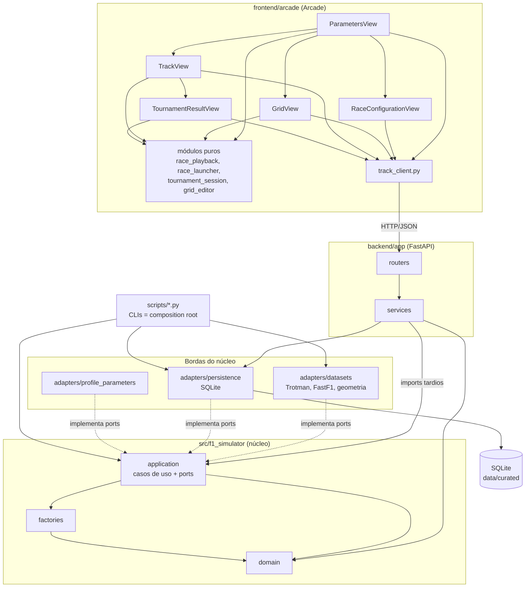
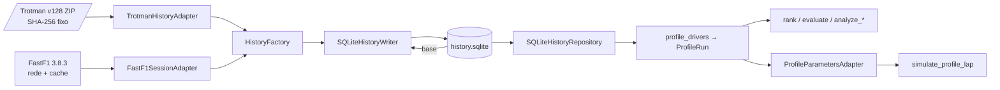

# Codebase Map

> Gerado pelo Cartographer em 2026-09-25 (commit `e86fe24`) e revisado à mão em
> 2026-10-16 sobre o commit `be2cdf7` (branch `6-reproducao-volta-a-volta`).
> As contagens de arquivos e tokens do mapa original foram retiradas por não
> terem sido recalculadas. Este arquivo é um índice de navegação: em caso de
> divergência, valem `AGENTS.md`, `CONTRIBUTING.md`, os ADRs em `docs/adr/` e o
> código.

## 1. Visão geral

Simulador de Fórmula 1 da disciplina MC857 (Unicamp). Um núcleo Python determinístico
(`src/f1_simulator`) contém domínio e casos de uso. As bordas são:

- **frontend desktop** em Arcade (`frontend/arcade`), que só fala HTTP com o backend;
- **backend FastAPI** (`backend/app`), que traduz HTTP para o núcleo;
- **ETL e datasets** (`scripts/`, `adapters/`), que ingerem o Trotman v128 (Kaggle, CC0) e
  enriquecem com o FastF1 3.8.3 offline;
- **persistência SQLite** (`adapters/persistence`).

O que existe **hoje** e o que não existe:

| Área | Estado |
|---|---|
| Motor de corrida | **Dois motores, `detailed` é o padrão.** `simulate_detailed_race` em `domain/race_simulation.py`: motor calibrado da #40 (combustível, pneu por composto, tráfego, paradas, disputas, abandonos) com perfis, disputa, SC/VSC/bandeiras e paradas **heurísticos** por cima (ADR 0008), clima no tempo de volta e tempo-base por velocidade física quando há geometria (ADR 0010). O núcleo simples de ritmo constante (`simulate_race`) foi removido em `d510721`. Valores em `docs/modelagem-heuristica.md`. Motor 2D opcional (`engine="2d"`, ADR 0011) em `domain/race_simulation_2d.py` + `track_space.py`: posição x,y contínua, ultrapassagem e colisão emergentes, com pneu/combustível/clima/abandono; **ainda sem** pit, reabastecimento, SC/VSC nem bandeiras, e não comparável ao histórico. |
| Grid e pilotos | `POST /catalog/grid` monta o grid por sorteio, à mão ou pela largada de uma corrida histórica (`race`); atributos por arquétipo, perfis fictícios nomeados por cima e edição via `PATCH`. |
| Torneio | Sequência de etapas montada no frontend; cada etapa é um `POST /catalog/grid/run` sobre o grid atual. Classificação do campeonato por `POST /championship/standings` (`domain/championship.py`). A rota de série livre do ADR 0006 foi removida (PRD v3 da modelagem heurística). |
| Frontend | Configuração do torneio, configuração de etapa (sessão e clima), pilotos e grid, reprodução volta a volta com controle de prova e classificação rica, resultado do torneio. "Confirmar torneio" roda as etapas no backend. |
| Perfis de pilotos orientados a dados | Estudos offline (ritmo por contexto, ranking, companheiros, avaliação entre eventos). Um adaptador alimenta o experimento de **uma volta**; o motor da corrida usa os atributos heurísticos, não esses perfis. |
| Combustível | Massa por carro e reabastecimento estratégico (`domain/fuel.py`, `HeuristicPitStrategy`), calibrado e validado em `data/parameters/fuel-v1.json` (ADR 0009). Sem o artefato, o backend usa o combustível linear da #40. |
| Pneus | Coeficientes do motor calibrado (#40, `data/parameters/model-v1.json`). Os estudos exploratórios da #63 não exportaram coeficientes. `tyre_severity` por circuito tem valores nos limites de corte (ver `docs/modelagem-heuristica.md`, §9). |

## 2. Arquitetura


```mermaid
graph TB
    subgraph Frontend["frontend/arcade (Arcade)"]
        PV[ParametersView]
        RCV[RaceConfigurationView]
        GV[GridView]
        TV[TrackView]
        TRV[TournamentResultView]
        PURE[módulos puros<br/>race_playback, race_launcher,<br/>tournament_session, grid_editor]
        TC[track_client.py]
    end
    subgraph Backend["backend/app (FastAPI)"]
        R[routers]
        S[services]
    end
    subgraph Core["src/f1_simulator (núcleo)"]
        D[domain]
        A[application<br/>casos de uso + ports]
        F[factories]
    end
    subgraph Edges["Bordas do núcleo"]
        AD[adapters/datasets<br/>Trotman, FastF1, geometria]
        P[adapters/persistence<br/>SQLite]
        PA[adapters/profile_parameters]
    end
    SC[scripts/*.py<br/>CLIs = composition root]
    DB[(SQLite<br/>data/curated)]

    PV --> RCV
    PV --> GV
    PV --> TV
    TV --> TRV
    PV & GV & TV & TRV --> PURE
    PV & RCV & GV & TV & TRV --> TC
    TC -- HTTP/JSON --> R
    R --> S
    S -- imports tardios --> A
    S --> D
    S --> P
    A --> D
    A --> F
    F --> D
    AD -. implementa ports .-> A
    P -. implementa ports .-> A
    PA -. implementa ports .-> A
    P --> DB
    SC --> AD
    SC --> P
    SC --> A
```

Regras estruturais (ADR 0002, `AGENTS.md`):

- `domain/` só importa `domain/`. Sem I/O, sem framework, sem SQLite.
- `application/` nunca importa SQLite, FastF1 nem CSV; isso é papel das bordas.
- **Adapter** normaliza formatos externos para DTOs; **Factory** constrói objetos válidos.
  Os dois se referenciam, mas não formam ciclo porque os DTOs em `application/*_dto.py`
  são módulos-folha.
- Ports são `typing.Protocol`, em `application/ports/`.
- `arcade.View`, widgets e estado da janela **não** são fonte de verdade da simulação.
- Aleatoriedade e dependências externas são injetáveis; simulações reproduzíveis por semente.

## 3. Estrutura de diretórios

```
.
├── AGENTS.md, CONTRIBUTING.md, README.MD, proposta.md
├── Desenvolvimento de Simulador F1.md   # escopo, fases, restrições do produto
├── pyproject.toml, uv.lock   # Python 3.12; dependências de frontend, backend e ETL
├── run.py                # sobe docker compose, espera o backend (até ~120 s), abre o frontend
├── docker-compose.yaml   # backend (porta 8000) e frontend nos perfis linux/wslg
├── backend/              # FastAPI (app/{routers,services,schemas}), Dockerfile, entrypoint.sh
├── frontend/arcade/      # cliente desktop Arcade + assets/
├── src/f1_simulator/     # núcleo hexagonal
│   ├── domain/           # entidades, esquemas, regras de perfil e simulação
│   ├── application/      # casos de uso, DTOs, ports/
│   ├── factories/        # validação e construção de objetos canônicos
│   └── adapters/         # datasets/ (Trotman, FastF1, geometria), persistence/ (SQLite), profile_parameters.py
├── scripts/              # CLIs de ETL, perfis, pneus, sync do backlog
├── configs/              # planos de avaliação congelados e drivers/perfis-ficticios.json
├── data/                 # sources/ e parameters/ versionados; raw/, curated/, simulation/ são gitignored
├── tools/                # race_viewer_template.html (visualizador do race_report.py)
├── tests/                # unittest + fixtures/ (Trotman e geometria)
├── docs/                 # ADRs, modelagem, ETL, backlog.md (espelho gerado), progresso.md
├── TOBEDEFINED/          # protótipo órfão (pista oval, RaceState); fora do pytest
└── .github/workflows/    # pull-request-rules.yml, sync-backlog.yml
```

## 4. Guia de módulos

### 4.1 `src/f1_simulator/domain/`

Convenções: dataclasses `frozen`, tuplas em vez de listas, unidades nos nomes (`_ms`, `_m`,
`_pct`, `_deg`, `_kmh`), ausência é `None` e **nunca zero**.

| Módulo | Propósito | Pontos de atenção |
|---|---|---|
| `race_data.py` | Agregado `RaceData` (circuito, corrida, pilotos, times, entradas, voltas, pits, `SourceId`, geometria opcional). IDs como `race:1141`, `driver:830`. | Geometria é opcional; nunca se infere traçado a partir de lat/long. |
| `track_geometry.py` | `TrackGeometry`, `TrackPoint`, `PitLanePoint`, `GeometryProvenance`. | X/Y **normalizados, sem unidade**; só `cumulative_distance_m` está em metros. |
| `race_simulation.py` | `simulate_detailed_race`: o motor da corrida. Devolve `history` (retrato por volta), `classification`, `race_control_events`, `race_control_by_lap` e `assumptions`. **Fonte de verdade da classificação.** | Sem os recursos opcionais, reproduz exatamente o motor calibrado da #40 (teste com hashes). Os recursos novos são só por palavra-chave. A compressão do SC reescreve o tempo acumulado (`tempo_lider + k*700 ms`). |
| `lap_time.py`, `tyres.py`, `model_parameters.py` | Decomposição auditável do tempo de volta (referência, combustível, pneu, tráfego, clima, boxes, ruído), penalidade por composto × `tyre_severity` e parâmetros versionados. | Só a degradação é escalada pela severidade do circuito. |
| `weather.py` | Umidade e água na pista por volta, `WeatherSegment`, `weather_penalty_ms`. | Afeta só o tempo de volta; parâmetros `assumed`. |
| `fuel.py` | Massa de combustível por carro (`FuelPlan`, `fuel_lap`), limite físico do reabastecimento (`must_pit`) e tempo de parada por equipe (`RefuelStops`). | Só ativo com `FuelPlan`; sem ele o motor legado não muda (hashes). Não sorteia nada. |
| `speed_dynamics.py` | Velocidade física por trecho (ADR 0010): envelope do carro (`CarPhysics`, `physics_for`), teto por curvatura e tempo de volta que emerge (`steady_lap`, `lap_time_ms`). | Consumido pelo motor detalhado (tempo-base por volta) e pelo 2D. `speed_at` sem consumidor (código morto). |
| `track_space.py` | Motor 2D (ADR 0011): pista em faixa com largura (`build_track_space`), estado espacial do carro (`CarSpaceState`), integração sub-volta multi-carro com ultrapassagem e colisão emergentes (`integrate_field`). | Mecânica espacial pura, selecionável. Não substitui o motor detalhado. |
| `race_simulation_2d.py` | Orquestra o motor 2D: roda `track_space` e devolve o mesmo `history`/`classification` do detalhado (`simulate_2d_race`). Pneu, combustível, clima e abandono mecânico via `speed_scale`. | Selecionável por `engine="2d"`. **Sem** pit, reabastecimento, SC/VSC nem bandeiras ainda. Sem testes permanentes. |
| `random_source.py` | `RandomSource` (protocolo) e `SeededRandomSource`, com `spawn` por chave via SHA-256. | Nunca `random` global; a semente é escolhida na borda. |
| `championship.py` | `championship_standings`: pontos F1 25-18-…-1, abandono não pontua, desempate por média ou vitórias. | Sem ponto de volta mais rápida. |
| `disputes.py` | Bloqueio, ultrapassagem e contato; modelos `legacy` e `pressure` (P/(P+R)) e bandeira azul. | Neutro por padrão; contato retira um dos dois no `pressure`. |
| `race_control.py` | Autômato de SC, VSC, amarela, vermelha e relargada. | Voltas sem incidente não consomem aleatoriedade. |
| `strategy.py` | Estratégias de parada, inclusive `HeuristicPitStrategy`, que com reabastecimento decide pneus e combustível juntos (`FuelStatus`, `FuelStrategyTraits`). | `decide()` determinístico; variação por piloto (offset e preferências de combustível) sorteada fora. |
| `driver_attributes.py`, `attribute_effects.py` | Atributos por arquétipo (`aggression`, `composure`) e seus efeitos. | Gestão de pneus amortecida no motor detalhado. |
| `driver_parameters.py` | `DriverPaceParameters`, `deterministic_lap_time`. | `variability_mode` só `"disabled"`. Arredonda **uma vez** com `ROUND_HALF_UP`. MAD e bootstrap não entram no tempo (evita contar carro duas vezes). |
| `driver_profile.py` | `METHOD_VERSION = "contextual-pace-v1"`, `ProfileConfig`, `PaceContext`, `assess_session`, `estimate_profiles`. | `ProfileConfig` não tem defaults. Cada volta é auditada com todas as razões de exclusão. Consistência é MAD, não sigma. |
| `context_sensitivity.py` | `ContextVariant`, `separate_stints`. | Reagrupamento exploratório; nunca relaxa exclusões de qualidade. |
| `profile_evaluation.py` | `EvaluationPlan`, `compare_profiles` (`profile-stability-v1`). | Estabilidade **em pp** entre eventos, não erro de predição. |
| `profile_reliability.py` | `BootstrapConfig(2000, 42, 0.95, 5)`, `profile_support`. | Reamostra **eventos**, não voltas. |
| `teammates.py` | `compare_teammates`, `context_reference` (`observed_context_field_median_v1`). | Gap simétrico `200*(a-b)/(a+b)`; trocar de equipe cria outro par. |
| `history.py` | Esquema tabular das 14 tabelas do Trotman (`HISTORY_SCHEMA`), `HistoricalRecord`. | `race_results` tem chave `result_id`; `laps` tem `record_number` (admite duplicatas). |
| `session_data.py` | Esquema das 10 tabelas de sessão FastF1 (`SESSION_SCHEMA`). | Relógios brutos separados, sem interpolação. |

### 4.2 `src/f1_simulator/application/`

**DTOs:** `race_data_dto.py` (`NormalizedRaceData`), `track_geometry_dto.py`.

**Ports** (`ports/`): `race_data.py` (`RaceDatasetPort`, `RaceDataWriterPort`, `RaceDataRepository`),
`track_geometry.py`, `history.py` (`HistoryDataset`, `HistoryWriter`, `HistoryRepository`),
`driver_parameters.py` (`DriverParametersProvider`).

| Caso de uso | O que faz |
|---|---|
| `race_data_ingestion.py` | `RaceDataIngestionService`: junção Adapter → Factory. |
| `etl.py` | `run_race_etl(...)`: ETL de uma corrida para SQLite mais relatório de qualidade. Geometria é opt-in; se pedida e inválida, **falha** (sem fallback). |
| `history_etl.py` | `run_history_etl(...)`: histórico completo em streaming; publica só se tudo validar. |
| `simulate_profile_lap.py` | Experimento de uma volta com um `DriverParametersProvider`. |
| `profile_drivers.py` | `ProfileRun`; só sessões `R`, com proveniência de ETL. |
| `rank_drivers.py` | Ranking de competição (1, 1, 3); indisponíveis no fim. |
| `evaluate_profiles.py`, `analyze_contexts.py`, `analyze_development.py`, `analyze_teammates.py` | Avaliações e sensibilidades. `analyze_development` **nunca lê** as sessões de validação reservadas. |
| `analyze_tyres.py`, `analyze_tyre_restarts.py`, `compare_tyre_estimators.py` | Estudos de pneus (#63), descritivos, sem coeficientes de motor. |
| `catalog.py`, `build_grid.py`, `generate_attributes.py` | Catálogo piloto@equipe e corridas do histórico, `starting_grid_pair_ids` (largada histórica), grid manual/aleatório, atributos por arquétipo, presets fictícios e overrides manuais. |
| `run_grid_simulation.py` | `run_detailed_grid_simulation`: liga grid, atributos, pista, clima e volta de referência ao motor; publica `setup`, `starting_grid` e `assumptions`. |
| `calibrate_model.py`, `backtest_model.py`, `reference_laps.py`, `pace_profiles.py` | Calibração do motor (#40), backtest contra a ordem de largada, voltas de referência por circuito e ritmo fora da amostra. |
| `calibrate_fuel.py` | Calibração e validação do combustível por massa (regressão de dois relógios com regressor volta × T × L) e do tempo de parada por equipe. |

### 4.3 `src/f1_simulator/factories/`

- `race_data_factory.py`: `RaceDataFactory.create` valida unicidades, referências e faixas; tipos exatos (bool não passa como int).
- `track_geometry_factory.py`: exige pista **fechada**, sequência contígua, progresso estritamente crescente e **exatamente um** ponto de serviço no pit.
- `history_factory.py`: campos exatamente os do esquema; `datetime` exige fuso; chaves e referências cruzadas são verificadas pelo writer na transação.

### 4.4 `src/f1_simulator/adapters/`

| Arquivo | Papel |
|---|---|
| `datasets/trotman_source.py` | Identidade imutável do dataset: v128 e SHA-256 do ZIP. |
| `datasets/acquisition.py` | `download_verified`: download atômico, idempotente por checksum. |
| `datasets/trotman.py` | `TrotmanDatasetAdapter`: uma corrida (8 CSVs) para `NormalizedRaceData`. Confere o SHA do ZIP. |
| `datasets/trotman_history.py` | `TrotmanHistoryAdapter`: 14 CSVs; contrato de colunas **exato**; ids com prefixo (`race:1141`). |
| `datasets/fastf1_sessions.py` | `FastF1SessionAdapter`: sessões 2018+, `fastf1==3.8.3` exato; única função com rede é `load_session`. |
| `datasets/mock_track_geometry.py` | Geometria reduzida (CSV + manifestos JSON com SHA-256), sem pandas/FastF1. |
| `persistence/sqlite_history.py` | `SQLiteHistoryWriter` (publicação atômica, enriquecimento idempotente por sessão) e `SQLiteHistoryRepository`. |
| `persistence/sqlite_race_data.py` | Escreve o SQLite de **uma corrida** (esquema enxuto). |
| `persistence/sqlite_race_data_repository.py` | Lê ambos os formatos (via views `race_entries` e `source_ids`). |
| `persistence/sqlite_track_geometry.py` | Geometria dentro do mesmo banco da corrida. |
| `profile_parameters.py` | `ProfileParametersAdapter`: `ProfileRun` → parâmetros por contexto exato. |
| `driver_presets_json.py`, `model_parameters_json.py`, `reference_laps_json.py`, `fuel_parameters_json.py` | JSON versionados: perfis fictícios (com o aviso), parâmetros do motor, voltas de referência e combustível (agrupado por origem). |
| `persistence/sqlite_calibration.py`, `sqlite_race_scenario.py`, `sqlite_inspection.py`, `sqlite_trotman_profiles.py` | Leitura para calibração e backtest, inspeção somente leitura e ponte com os perfis. |

### 4.4.1 `scripts/` (composition roots das CLIs)

- **ETL:** `download_trotman.py`, `list_races.py`, `ingest_trotman.py` (`--race-id` ou `--all-tables`), `ingest_fastf1.py` (`--base`, `--season`, `--rounds`, `--sessions`, `--strict`, `--without-telemetry`).
- **Pilotos:** `profile_drivers.py`, `rank_drivers.py`, `evaluate_profiles.py`, `analyze_profile_development.py`, `analyze_profile_contexts.py`, `analyze_teammates.py`.
- **Pneus:** `analyze_tyres.py`, `analyze_tyre_restarts.py`, `compare_tyre_estimators.py`.
- **Motor:** `calibrate_model.py`, `calibrate_fuel.py`, `backtest_model.py`, `build_reference_laps.py`, `race_control_frequency.py`, `race_report.py` (corrida explicada, `--html` com visualizador).
- **Geometria:** `rebuild_fastf1_geometry.py`.
- **Manutenção:** `sync_github_backlog.py` (gera `docs/backlog.md`; requer `gh` autenticado).
- Todos inserem `src/` no `sys.path`. Resultados são publicados em pasta nova com sufixo uuid (rename atômico), nunca sobrescrevem, e recusam escrever em `data/raw`.

### 4.5 `backend/app/`

| Arquivo | Papel |
|---|---|
| `main.py` | FastAPI; routers `health`, `etl`, `history`, `simulation`, `catalog`, `championship`; CORS `*`. |
| `config.py` | Caminhos fixos no container (`/data/curated`, `/data/simulation`); parâmetros do modelo e voltas de referência caem no caminho do repositório fora do container. |
| `routers/catalog.py`, `services/catalog.py` | Catálogo, grid (montagem, leitura, edição), execução da corrida e corridas salvas. Composition root do motor. |
| `routers/championship.py` | Classificação do torneio sobre `domain/championship.py`. |
| `routers/simulation.py` | Corrida atual, corridas salvas e geometria. |
| `routers/history.py`, `services/history.py` | Construção e inspeção do `history.sqlite`; lista de corridas. |
| `routers/etl.py`, `services/race_inspection.py`, `services/inspection.py` | Inspeção somente leitura do SQLite de corrida, via `SQLiteDatabaseInspector`. **Sem SQL.** |
| `services/track_geometry.py` | Catálogo de pistas (manifesto) e geometria. |
| `services/errors.py` | `ETLError` com `reason` → status (validation 422, source 404, storage 500). |

**Rotas:**

| Método | Caminho | Observação |
|---|---|---|
| GET | `/` | Health; usado pelo polling do `run.py`. |
| GET | `/api/etl/{tables,schema/{t},preview/{t},table/{t},database/dump}` | Inspeção de `current-race.sqlite`; `table` e `dump` sem paginação. |
| POST | `/api/history/build` | Roda `run_history_etl`; necessário antes do catálogo e do grid. |
| GET | `/api/history/{tables,schema/{t},preview/{t},reports}` | Inspeção de `history.sqlite`. |
| GET | `/api/history/races` | Corridas do histórico; `?season=` filtra. |
| GET | `/catalog` | Pares piloto@equipe do histórico. |
| POST/GET/PATCH | `/catalog/grid` | Monta (`random`, `manual`, `race`), lê e edita o grid atual (`data/simulation/current-grid.json`). A resposta traz `profile` e `profiles_disclaimer`. |
| POST | `/catalog/grid/run` | Roda o grid no motor detalhado; grava `current-race.json` e uma corrida salva. |
| POST | `/championship/standings` | Tabela do torneio a partir das chegadas. |
| GET | `/simulation/race` | Última corrida rodada; 404 antes da primeira. |
| GET/POST | `/simulation/saved`, `/simulation/saved/{id}` | Lista, salva e abre corridas salvas. |
| GET | `/simulation/tracks` | Catálogo de 24 pistas. |
| GET | `/simulation/track/{circuit_id}` | Geometria; aceita `circuit:18` ou `18`. |

### 4.6 `frontend/arcade/`

Entrada: `python -m frontend.arcade` (`__main__.py`). O frontend **não importa**
`f1_simulator` (a imagem do frontend não o contém): regras de domínio chegam por
HTTP. Os módulos marcados "puro" não importam Arcade e são testados sem janela.

| Arquivo | Papel |
|---|---|
| `parameters_view.py` | Tela inicial "Configuração do torneio": catálogo de pistas, sequência com drag-and-drop, regras, botão **Pilotos e grid**. "Confirmar torneio" roda o plano no backend (`backend_simulation_runner`) numa thread. |
| `race_configuration_view.py` | Configuração por etapa. Abas **Sessão** e **Clima** funcionais; Pista, Regras e Carros são placeholders. |
| `grid_view.py` | Pilotos e grid: montar (aleatório ou largada de 2024), ver perfis, editar atributos. |
| `track_view.py` | `TrackView` (reprodução volta a volta, controle de prova, classificação rica, navegação do torneio) e `MenuView` (corridas salvas). |
| `tournament_view.py` | Resultado do torneio, pedido a `POST /championship/standings`. |
| `race_playback.py` (puro) | Linha do tempo por carro a partir do `history`: progresso, pneu, parada, abandono, classificação ao vivo. |
| `race_control_feed.py` (puro) | Status por volta e mensagens de controle de prova. |
| `race_launcher.py` (puro) | `SimulationPlan` → pedidos do backend; política de grid; avisos de opções não suportadas. |
| `tournament_session.py` (puro) | Navegação entre etapas e pedido/resposta do campeonato. |
| `grid_editor.py` (puro) | Rascunho de edições do grid, rótulos e passos dos atributos, opções de montagem. |
| `configuration_state.py` (puro) | `WeatherSchedule`, `TournamentRules`, `SessionConfiguration`, `ConfigurationFormData`, `SimulationPlan`. |
| `configuration_layout.py`, `track_preview.py` (puros) | Geometria de layout e da prévia. |
| `track_client.py` | HTTP com `urllib` (`F1_API_BASE_URL`, padrão `http://localhost:8000`); GET, POST e PATCH; `BackendError` com o `detail` do FastAPI. |
| `weather_view.py` | `TrackConfigurationView`, tela **legada** 1280x720, inalcançável no fluxo atual (constantes e helpers reaproveitados). |
| `theme.py` | Cores. |

### 4.7 `tests/`

- Execução: `uv run python -m unittest -v` (a partir da raiz). Sem as dependências, `python3 -m unittest` roda o núcleo e falha na importação dos testes que usam FastAPI. O `pyproject.toml` ainda declara `testpaths` para pytest, que não é dependência.
- Testes de GUI (`test_parameters_view.py`) exigem `ARCADE_GUI_TEST=1` e um display; ficam pulados por padrão. Três deles falham desde antes de 2026-10-16 (layout).
- Dois testes de `test_catalog_grid_run.py` gravam em `/data/simulation` e só passam no container.
- Nenhum teste acessa a rede (FastF1 é sintético; download simulado com `file://`).
- Fixtures: `trotman_v128_history/` (corrida 1141, 14 CSVs), `trotman_v128_sample/`, `trotman_v128_tracks_2025/` (24 pistas x 240 pontos; pit lane 24 x 80).
- **Helpers compartilhados** (acoplamento implícito): `history_support.py`, e exports de `test_driver_profile.py` (`CONFIG`, `record`, `lap`), `test_profile_evaluation.py` (`MemoryHistory`, `plan`), `test_tyres.py` (`rows`). Mudar esses módulos pode quebrar vários outros.

## 5. Fluxos de dados

### 5.1 Torneio pela interface

```mermaid
sequenceDiagram
    participant U as Usuário
    participant PV as ParametersView
    participant GV as GridView
    participant API as FastAPI
    participant SIM as run_detailed_grid_simulation
    participant TV as TrackView

    PV->>API: GET /simulation/tracks
    U->>GV: (opcional) monta e edita o grid
    GV->>API: POST/PATCH /catalog/grid
    U->>PV: monta sequência, voltas, clima; Confirmar torneio
    PV->>API: GET /catalog/grid (ou POST, se não houver)
    loop cada etapa
        PV->>API: POST /catalog/grid/run {setup}
        API->>SIM: grid + atributos + pista + clima
        SIM-->>API: history, classification, eventos, assumptions
        PV->>API: GET /simulation/track/{id}
    end
    PV->>TV: etapa 1 (Próxima etapa → demais)
    TV->>API: POST /championship/standings (resultado do torneio)
```

### 5.2 ETL (offline, sem HTTP entre os componentes)


```mermaid
graph LR
    ZIP[/Trotman v128 ZIP<br/>SHA-256 fixo/] --> ADT[TrotmanHistoryAdapter]
    ADT --> HF[HistoryFactory]
    HF --> HW[SQLiteHistoryWriter]
    HW --> H[(history.sqlite)]
    FF[FastF1 3.8.3<br/>rede + cache] --> FA[FastF1SessionAdapter]
    FA --> HF
    H -- base --> HW
    H --> HR[SQLiteHistoryRepository]
    HR --> PD[profile_drivers → ProfileRun]
    PD --> AN[rank / evaluate / analyze_*]
    PD --> PPA[ProfileParametersAdapter]
    PPA --> SPL[simulate_profile_lap]
```

Passos: `download_trotman.py` → `ingest_trotman.py --all-tables` → `ingest_fastf1.py --base ...` →
consumo por `SQLiteHistoryRepository`. O modo `--race-id` gera outro SQLite (esquema enxuto,
com `race_entries` como tabela real) usado pelo backend.

### 5.3 Corrida pela API

`POST /api/history/build` (uma vez) → `POST /catalog/grid` → `POST /catalog/grid/run`
→ `data/simulation/current-race.json` e `saved-races/` → `GET /simulation/race`.
O caminho histórico antigo (`/simulation/load`, `/simulation/simulate`,
`loader.py`) foi removido antes de 2026-10-03.

## 6. Convenções

- **Idioma:** código, docstrings, mensagens e docs em português; identificadores em inglês.
- **IDs canônicos:** `entidade:<id_externo>` (`race:1124`, `driver:842`, `circuit:7`, `session:<raceId>:R`).
- **Unidades no nome** e convertidas na ingestão; tempos em ms inteiros; `\N` do Trotman vira `None`.
- **Ausência nunca é zero.** Perfis indisponíveis carregam `unavailable_reason`.
- **Escritas atômicas:** arquivo temporário no mesmo diretório e `os.replace` / `os.link`.
- **Versionamento explícito** de métodos (`contextual-pace-v1`, `profile-stability-v1`, `context-reliability-v1`) e hashes (`*_sha256`) para reprodutibilidade.
- **Aleatoriedade:** o motor sorteia só por `RandomSource` injetado e semeado (`SeededRandomSource`, fluxos por `spawn`); a semente é escolhida na borda e devolvida no resultado. Estatística offline usa `Random(seed)` local (bootstrap, semente 42).
- **Commits:** `tipo(escopo): resumo` no imperativo; só com autorização do usuário.
- **Backlog:** GitHub Issues é a fonte; `docs/backlog.md` é espelho gerado e **nunca se edita à mão**. Fallback: `docs/progresso.md`.
- **PRs:** só `develop` pode virar PR para `main` (workflow `pull-request-rules.yml`).

## 7. Gotchas

**Divergências entre docs e código**

1. Estudos e propostas de setembro (`planejamento-modelagem.md`, `contrato-perfil-simulacao.md`, `ranking-e-adaptador-pilotos.md`, `modelagem-pneus-inicial.md`, `perfilamento-pilotos.md`) citam `backend/app/engine/simulation.py`, `frontend/arcade/oval_track.py`, `race_view.py`, `loader.py` ou a série livre. Esses caminhos não existem mais; os documentos ganharam uma nota de estado e continuam como registro histórico.
2. Estudos de setembro reproduzem comandos com `pipenv run`; não há `Pipfile` versionado. As dependências estão no `pyproject.toml` (`uv run`).
3. `TOBEDEFINED/*` importa `frontend.arcade.oval_track` e `race_state`, que só existem ali; nada executa. Excluído da descoberta por `norecursedirs`.
4. ADR 0001 e 0002 ainda mencionam Django no corpo; o ADR 0004 (FastAPI) o substitui.
5. O ADR 0006 (aceito) previa `POST /simulation/series/simulate` com ritmos informados pelo usuário; a rota foi removida (PRD v3 da modelagem heurística) sem um ADR que a substitua. O ADR 0007 segue como proposta, com contexto desatualizado.
6. As 6 sessões de validação de 2024 **já foram examinadas** (18/09/2026). `configs/profile-validation-decision-2024.json` registra `reserved_metrics_examined=false` apenas para o momento em que foi escrito. Não tratar a reserva como inédita.
7. O pacote `f1_simulator` não é instalado (`PYTHONPATH=src`; `tests/__init__.py` insere o caminho).

**Comportamento não óbvio**

- **Banco histórico obrigatório:** catálogo e grid dão 404 até `POST /api/history/build`. O `entrypoint.sh` só baixa o ZIP e gera `races-index.json`.
- **Arquivos do container com dono root:** `data/curated/history.sqlite` e `data/simulation/` são criados pelo container como root no host.
- **Reload parcial:** o uvicorn recarrega `/app` (backend); mudanças em `src/` exigem reiniciar o container.
- **Voltas padrão:** toda etapa nova começa com 69 voltas (`configuration_state.py`), qualquer que seja a pista; pendência em `docs/progresso.md`.
- **Registros do histórico** (`HistoricalRecord`) só aceitam indexação, sem `.get`.
- **Geometria vem de fixture de teste:** o compose monta `tests/fixtures/trotman_v128_tracks_2025` sobre `/data/geometry`. Geometria 2025 não é layout verificado de outra temporada, e o comprimento da volta é aproximado.
- **Docker:** os binds sobrescrevem o `COPY` da imagem; o código é sempre o do host.
- **Duas variantes de SQLite:** modo `--race-id` (esquema enxuto) e `--all-tables` (histórico). `ingest_fastf1` só aceita o histórico. `SQLiteRaceDataRepository` lê ambos; `SQLiteHistoryRepository.get_race` **recusa** corridas com carro compartilhado ou volta duplicada.
- **Valores fixos no código:** `rank_drivers.py` e `analyze_tyre_restarts.py` citam "18 eventos" nos gráficos; `analyze_tyre_restarts.py` tem sessões e pilotos fixos; `compare_tyre_estimators.interval` fixa seed 42 e 2000 réplicas.
- **Frontend:** `_OPENER` de `track_client.py` é criado no import, na thread da UI, para evitar `ssl.SSLError` no Fedora/Pyglet. `ParametersView` desenha em canvas lógico 1280x720 numa janela 1672x900; as demais telas usam o tamanho real da janela. A fonte "monospace" não é monoespaçada em todos os sistemas: tabelas usam um texto por coluna. Pistas repetidas compartilham configuração por `circuit_id`.
- **Testes de GUI** usam coordenadas fixas; ajustes de layout em `parameters_view.py` ou `race_configuration_view.py` os quebram.
- **CI:** não há CI de testes, lint ou tipos; só a regra de branch de origem e o sync manual do backlog (que faz push direto no branch default).
- **Licenças:** Trotman é CC0. O software do FastF1 é MIT, mas os **dados** dele seguem os termos do upstream. Dados brutos, telemetria e bancos completos ficam fora do Git.

## 8. Guia de navegação

| Para... | Toque em |
|---|---|
| Adicionar uma tabela ao histórico | `domain/history.py` (esquema) → `adapters/datasets/trotman_history.py` (`MAPPINGS`) → testes em `test_history_etl.py` |
| Adicionar um feed FastF1 | `domain/session_data.py` → `adapters/datasets/fastf1_sessions.py` → `sqlite_history.py` |
| Novo endpoint | `backend/app/routers/`, schema em `schemas/responses.py`, serviço em `services/`; lógica no núcleo, não no router |
| Alterar a regra de simulação | `domain/race_simulation.py` (+ `disputes.py`, `race_control.py`, `strategy.py`); testes em `test_race_engine.py`, `test_detailed_race_heuristics.py` |
| Ajustar uma heurística | `docs/modelagem-heuristica.md` (tabela "Como reajustar") |
| Mudar atributos, perfis ou o grid | `domain/driver_attributes.py`, `configs/drivers/perfis-ficticios.json`, `application/generate_attributes.py`, `application/build_grid.py` |
| Usar perfis orientados a dados no motor | `application/ports/driver_parameters.py` + `adapters/profile_parameters.py` + `domain/driver_parameters.py`; falta política para contexto ausente e referências por volta |
| Novo estudo de pneus | `application/analyze_tyres.py` (base), `scripts/analyze_tyres.py`; helpers de teste em `tests/test_tyres.py` |
| Nova tela Arcade | `frontend/arcade/`; estado e regras de apresentação em módulo puro (sem Arcade), HTTP em `track_client.py`, chamadas em thread com resultado lido em `on_update` |
| Nova fonte de dados | Exige decisão explícita e ADR: registrar versão, data, licença e transformações |
| Mudança de arquitetura ou de tecnologia | Novo ADR aceito em `docs/adr/` |
| Regenerar o backlog | `python3 scripts/sync_github_backlog.py` (nunca editar `docs/backlog.md`) |

## 9. Decisões (ADRs) e estado do produto

| ADR | Decisão |
|---|---|
| 0001 | Frontend desktop Arcade; uma `Window` com `View`s; HTTP/JSON; tempo simulado pertence ao backend. |
| 0002 | Arquitetura hexagonal (MVC rejeitado); Adapter + Factory; fonte única Trotman v128. |
| 0003 | Geometria reduzida derivada do FastF1 (24 etapas de 2025 + Interlagos/2024), só offline. |
| 0004 | FastAPI substitui Django; ETL, modelagem e motor colaboram por contratos Python, sem HTTP. |
| 0005 | Histórico completo (14 CSVs) e enriquecimento FastF1 offline em SQLite com proveniência. |
| 0006 | Sequência de corridas livres sem evento histórico obrigatório. A rota prevista foi removida; o torneio atual a realiza pelo frontend sobre `/catalog/grid/run`. |
| 0007 | (proposta) Não determinismo com parâmetros assumidos; contexto a revisar pelo grupo. |
| 0008 | Perfis, disputa, SC/VSC/bandeiras e paradas heurísticos sobre o motor calibrado da #40. |

**Backlog:** ver `docs/backlog.md` (espelho gerado). Frentes de modelagem no épico
#40: #51 pistas, #60 carros, #61 pilotos (#66, #67), #62 clima, #63 pneus. Tela de
simulação: #6 (#16, #18, #19, #21). Consumidoras: #70 e #71, filhas de #8.

**Pendências principais registradas nos docs:**

- Modelagem: composto de largada fixo, ausência de pneus de chuva, `tyre_severity` nos limites de corte e paradas em excesso em pistas severas (`docs/modelagem-heuristica.md`, §9); clima fora de disputas e incidentes; a pole vence com frequência alta.
- Interface: voltas padrão por pista; abas Pista, Regras e Carros; intervalo de sessão e largada lançada no motor.
- Pilotos orientados a dados: integrar ao motor; separar efeito piloto/carro.
- Decisões: substituir ou revisar os ADRs 0006 e 0007.
