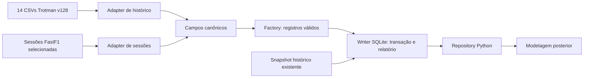

# ETL completo do Trotman e enriquecimento FastF1

Implementação da branch `24-enriquecimento-etl`, vinculada à
[#24 — ETL inicial](https://github.com/guilherme-webster/mc857-o-projeto/issues/24).
A branch parte de `40-planejamento-modelagem` em `ef1859c`; não modifica
`develop` nem implementa o perfilamento da branch #67. Escopo autorizado no
[ADR 0005](adr/0005-historico-completo-e-enriquecimento-fastf1.md).

## Fluxo e responsabilidades



`run_history_etl` articula a ingestão por portas. O adapter traduz a fonte; a
Factory valida forma, tipos e faixas; o writer verifica chaves/referências e
publica um SQLite completo. O relatório é armazenado em `imports`, dentro do
mesmo banco, evitando um par banco/JSON de versões diferentes após falha.

O catálogo completo usa `HistoricalRecord`, um objeto imutável com campos
canônicos definidos em [history.py](../src/f1_simulator/domain/history.py) e
[session_data.py](../src/f1_simulator/domain/session_data.py). Não é um dump dos
DataFrames externos. `RaceData` continua sendo o agregado menor para uma corrida
compatível; não precisa comportar todas as observações de calibração.

## Cobertura dos 14 CSVs

Todos os campos do snapshot v128 são mapeados explicitamente em
[trotman_history.py](../src/f1_simulator/adapters/datasets/trotman_history.py).
Arquivo, coluna inesperada ou referência ausente geram erro. Não há filtro de
corrida ou temporada no modo completo.

| CSV | Tabela canônica | Informações preservadas além do recorte anterior |
| --- | --- | --- |
| `circuits.csv` | `circuits` | Referência externa e URL, além da localização. |
| `drivers.csv` | `drivers` | `driver_ref`, número, nascimento, nacionalidade e URL. |
| `constructors.csv` | `teams` | Referência, nacionalidade e URL. |
| `seasons.csv` | `seasons` | Temporadas e URLs. |
| `races.csv` | `races` | Todos os eventos, URL e datas/horários das demais sessões. |
| `status.csv` | `statuses` | Dicionário completo de situações de término. |
| `results.csv` | `race_results` | Identificador do resultado, pontos, posição textual, melhor volta e velocidade. |
| `sprint_results.csv` | `sprint_results` | Resultados de sprint, com suas próprias chaves. |
| `qualifying.csv` | `qualifying` | Posições e tempos Q1/Q2/Q3 em ms. |
| `constructor_results.csv` | `constructor_results` | Pontos e situação do construtor por corrida. |
| `driver_standings.csv` | `driver_standings` | Classificação acumulada, pontos e vitórias. |
| `constructor_standings.csv` | `constructor_standings` | Classificação acumulada das equipes. |
| `lap_times.csv` | `laps` | Todas as observações e representação textual original. |
| `pit_stops.csv` | `pit_stops` | Relógio informado pela fonte e duração textual, além de ms. |

`\N` e células vazias tornam-se `None`; zero permanece zero. IDs de entidades
mantêm os prefixos existentes (`race:1141`, `driver:830`, `team:9`). Tempos
Q1/Q2/Q3 e melhor volta são convertidos com aritmética decimal para ms.
Textos de resultado como diferenças de tempo/voltas são preservados como texto.
Datas são ISO; o relógio de pit stop é `source_clock_time`, sem atribuir UTC.

Resultados antigos podem ter mais de uma inscrição por piloto/corrida: a chave
é `result_id`. Voltas recebem `record_number`, ordinal dentro do arquivo com
checksum. Ele identifica uma observação desse snapshot, não uma entidade
estável entre versões. Repetições/conflitos aparecem em `business_key_warnings`.
Não usar a soma de registros como quantidade de voltas únicas sem verificar isso.

## Complementos FastF1

O [índice oficial de dados](https://github.com/theOehrly/Fast-F1/blob/v3.8.3/docs/data_reference/index.rst)
orienta a cobertura. A biblioteca oferece dados detalhados a partir de 2018;
disponibilidade varia entre sessões. Nesta revisão, o site de documentação
retornou 403, então foram consultadas suas fontes oficiais na versão 3.8.3.

| Tabela | Conteúdo e limite |
| --- | --- |
| `sessions` | Evento/ID canônico, tipo, data UTC, origem do relógio e rotação do mapa. |
| `session_drivers` | Mapeamento entre número na sessão e piloto canônico; resultados/contexto da sessão. |
| `lap_observations` | Setores, stint, composto, idade do pneu, boxes e indicadores de qualidade. |
| `weather_observations` | Temperaturas, umidade, pressão, vento e ocorrência booleana de chuva. |
| `track_status_events` | Mudanças de bandeiras/situação da pista, preservando os códigos. |
| `session_status_events` | Início, interrupções e término da sessão. |
| `race_control_messages` | Mensagens, flags, escopo e referências a piloto/setor quando fornecidas. |
| `car_samples` | Velocidade, RPM, marcha, acelerador, freio booleano e código DRS. |
| `position_samples` | XYZ convertidos de décimos de metro para metros, situação e origem da amostra. |
| `circuit_markers` | Curvas, postos/setores de sinalização e distância estimada quando disponível. |

Campos e conversões estão em
[fastf1_sessions.py](../src/f1_simulator/adapters/datasets/fastf1_sessions.py).
O catálogo Trotman continua sendo a referência de identidade/evento. O
`DriverId` da sessão é associado a `driver_ref`; só depois o número daquela
sessão identifica suas observações. Identidade desconhecida, evento ou tipo
de sessão incorretos interrompem a importação. Não há aproximação por nome ou
associação por número global.

As datas/resultados de sessão e seus tempos podem coincidir com dados Trotman;
ficam separados para preservar contexto e permitir comparação. Não são usadas
para substituir o histórico automaticamente. Calendário/cadastro e endpoints
Jolpica já cobertos pelo Trotman não recebem outro catálogo concorrente.

Os relógios de amostras de carro e posição são preservados, sem merge ou
reamostragem. Os marcadores usam o sistema de mapa upstream (`map_x/map_y`),
não XY normalizado da fixture #51; sua distância é uma estimativa. A fonte
descreve os marcadores como referências manuais aproximadas de visualização.
[Referência oficial de CircuitInfo](https://github.com/theOehrly/Fast-F1/blob/v3.8.3/fastf1/mvapi/data.py).

`throttle_raw_pct` conserva o valor fornecido. Valores fora de 0–100, como o
sentinela 104, deixam `throttle_pct=None` e incrementam um aviso. Freio é
booleano; chuva não mede intensidade; nulo não vira falso. Campos como
`generated`, `accurate` e `deleted` permanecem disponíveis para o consumidor
definir filtros. O ETL não certifica pista livre nem estima habilidade.
[Contratos oficiais de telemetria e voltas](https://github.com/theOehrly/Fast-F1/blob/v3.8.3/fastf1/core.py).

## Executar

O histórico Trotman usa apenas a biblioteca padrão. O comando anterior por
corrida (`--race-id`, `--report`, geometria opcional) continua funcionando.
Para o catálogo inteiro, após a aquisição/verificação já existente:

```bash
python3 scripts/download_trotman.py
python3 scripts/ingest_trotman.py --all-tables \
  --source data/raw/formula-1-race-data-v128.zip \
  --output data/curated/history.sqlite
```

O modo completo não recebe `--report` ou `--geometry-dir`: seu relatório é
interno, e a ingestão de geometrias #51 continua no fluxo por corrida. O writer
de enriquecimento preserva as tabelas do banco-base; não migra automaticamente
um banco antigo de corrida para o catálogo completo.

Instalar FastF1 em um ambiente isolado, sem acrescentá-lo ao motor:

```bash
python3 -m venv /tmp/mc857-etl-venv
/tmp/mc857-etl-venv/bin/python -m pip install -r requirements-etl.txt
/tmp/mc857-etl-venv/bin/python scripts/ingest_fastf1.py \
  --base data/curated/history.sqlite \
  --race-id 1141 --sessions R Q \
  --output data/curated/history-fastf1-2024.sqlite --strict
```

Para outra seleção, usar `--season 2024 --rounds 1 21 --sessions R Q` em lugar
de `--race-id`. Sem `--rounds`, todos os eventos daquela temporada presentes no
catálogo são solicitados. Sessões permitidas: `R Q FP1 FP2 FP3 S SQ SS`; uma
sessão inexistente ou indisponível pode fazer o lote falhar. O comando não
promete que todos os tipos existam em todas as etapas.

Por padrão, amostras de carro e posição são solicitadas. `--without-telemetry`
é uma exclusão explícita, registrada como `not_requested`. Cada feed recebe
estado `available`, `empty`, `partial` ou `unavailable`; `--strict` rejeita feeds
indisponíveis e telemetria sem algum piloto esperado. Isso não garante que
todas as células estejam preenchidas ou que cada amostra seja confiável.

O cache padrão é temporário e removido ao final. Para repetir downloads com
cache local, acrescentar `--cache-dir data/raw/fastf1-cache`. Fontes brutas,
caches e bancos permanecem fora do Git. Fonte, versão da biblioteca e
dependências, instante da aquisição, conversões, checksums e cobertura ficam
no manifesto. A licença MIT da biblioteca não abrange todos os dados upstream.

Saídas existentes são recusadas por padrão. `--overwrite` autoriza substituição
somente após sucesso. O lote FastF1 acumula sessões em um banco temporário;
qualquer erro preserva a saída anterior. Para adicionar sessões ao resultado,
usar o banco enriquecido como `--base`. Reingerir uma sessão substitui seus
registros, preservando histórico e outras sessões; não cria uma segunda cópia.

## Consumir pela modelagem

```python
from pathlib import Path
from f1_simulator.adapters.persistence.sqlite_history import SQLiteHistoryRepository

repository = SQLiteHistoryRepository(Path("data/curated/history-fastf1-2024.sqlite"))
for lap in repository.records("lap_observations", session_id="session:1141:R",
                              driver_id="driver:830"):
    print(lap["lap_number"], lap["compound"], lap["sector1_ms"], lap["accurate"])

reports = repository.reports()
race = repository.get_race("race:1141")
```

As consultas aceitam filtros exatos por campos canônicos e iteram em ordem de
chave. O consumidor não abre CSV nem conhece tabelas upstream. `get_race`
reutiliza o repository existente para corridas compatíveis; rejeita projeção
de múltiplas inscrições por piloto ou observações duplicadas por volta. Os
fatos completos continuam consultáveis em `race_results`/`laps` nesses casos.

Relatório JSON externo, quando necessário, pode ser exportado a partir do
repository, sem constituir uma segunda fonte de verdade:

```bash
PYTHONPATH=src python3 - <<'PY'
import json
from pathlib import Path
from f1_simulator.adapters.persistence.sqlite_history import SQLiteHistoryRepository
repo = SQLiteHistoryRepository(Path("data/curated/history-fastf1-2024.sqlite"))
print(json.dumps(repo.reports(), ensure_ascii=False, indent=2))
PY
```

## Verificação desta entrega e próximos consumidores

O ZIP completo foi importado: 14 tabelas, 1.172 corridas e 879.870 observações
de volta. O relatório identifica 1.979 chaves repetidas e 272 conflitos de
tempo/posição, nas corridas `race:356` e `race:372`.

Foram adquiridas e ingeridas **corrida e classificação de São Paulo/2024**:

| Registros | Corrida | Classificação |
| --- | ---: | ---: |
| Pilotos na sessão | 20 | 20 |
| Observações de volta | 1.134 | 425 |
| Observações de clima | 201 | 107 |
| Amostras de carro | 901.200 | 479.840 |
| Amostras de posição | 931.180 | 488.880 |
| Marcadores do circuito | 47 | 47 |

Na corrida, 1.097 tempos não nulos puderam ser associados às voltas Trotman,
sem diferenças de ms nessa amostra. Os demais registros não foram inventados
ou descartados para forçar igualdade. A classificação é armazenada como outra
sessão e não é comparada à tabela de voltas da corrida. Esta validação cobre
um evento, não comprova cobertura de toda a temporada nem calibração de perfis.

Testes offline cobrem os 14 esquemas, nulos, unidades, mapeamento de identidade,
conflitos, falhas e reingestão. Também foi corrigida uma aspa não fechada no
repository antigo, detectada ao testar a compatibilidade. A suíte terminou com
99 testes, sem falhas e 13 ignorados por condições de interface gráfica. Ruff
e verificações de whitespace passaram; o banco final passou em
`integrity_check` e não apresentou referências órfãs em `foreign_key_check`.
Executar:

```bash
python3 -B -m unittest -v
```

Para #66/#67: definir a amostra entre eventos, alinhar clima/bandeiras aos
relógios das voltas com tolerância explícita e escolher filtros antes de
estimar ritmo/consistência. A geometria de trechos, aderência, intensidade de
chuva, gestão de pneus e comportamento de ultrapassagem continuam modelagem
posterior; não são resultados deste ETL. #43 deve consumir os mesmos contratos
Python e evitar um segundo cálculo de parâmetros nas rotas.
