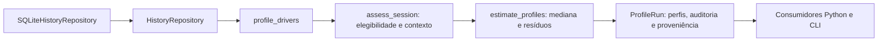

# Modelagem inicial de pilotos — ritmo e consistência contextualizados

Implementação experimental `contextual-pace-v1`, vinculada a #61/#66/#67 e ao
pedido de implementar a modelagem após integrar o ETL. Desenvolvida na branch
`40-modelagem-dos-dados`, worktree `mc857-etl-enriquecimento`. O
[planejamento de perfilamento](perfilamento-pilotos.md) continua como histórico
e roteiro das extensões. Este documento especifica o comportamento executável.

## Recorte entregue

O modelo descreve desempenho observado do conjunto piloto/equipe em corridas
selecionadas. Estima ritmo relativo e dispersão robusta dentro de contextos
comparáveis. Não identifica habilidade independente do carro, personalidade,
peso, altura, agressividade, aderência ou degradação atribuível ao piloto.
Não gera notas 0–100 nem coeficientes de chuva.

O cadastro `Driver` existente permanece separado do `DriverProfile` imutável.
O perfil não contém estado mutável de corrida. O caso de uso
`profile_drivers(repository, session_ids=..., config=...)` consome a porta
`HistoryRepository` já implementada pelo ETL; não usa HTTP, SQL, CSV, Pandas
ou FastF1 no núcleo. Não existe uma segunda fórmula nas rotas do backend.



As sessões são explicitamente selecionadas pelos IDs canônicos. Somente
corrida (`R`) é aceita nesta versão. Classificação está disponível no ETL,
mas comparar Q1/Q2/Q3 exige outro método; não misturar essas observações com
voltas de corrida. Banco sem enriquecimento ou sessão sem manifesto produz
erro claro. Pilotos inscritos sem voltas permanecem no resultado, com motivo
de indisponibilidade.

## Elegibilidade e alinhamento temporal

Cada observação recebe todos os motivos aplicáveis de exclusão. A seleção não
modifica nem remove fatos do ETL. Para entrar na comparação, uma volta precisa:

- tempo positivo, chave única e vínculo único piloto/equipe nos resultados
  **do evento**; não usar número de carro como identidade global;
- não ser a primeira volta nem conter entrada/saída dos boxes;
- `accurate=True`, `deleted=False`, `generated=False` e `track_status="1"`;
  qualidade desconhecida é excluída;
- composto conhecido, stint e idade do pneu presentes;
- relógios de início e fim presentes e crescentes;
- estado da sessão `Started` durante todo o intervalo;
- cobertura de clima durante toda a volta, dentro da tolerância e sem mudança
  da precipitação booleana observada.

O manifesto precisa declarar a lista de colunas de volta ausentes como vazia.
Lista ausente ou não vazia torna a sessão inelegível (`lap_schema_incomplete_or_unknown`).
É uma escolha conservadora: ausência de uma coluna de boxes não pode ser
interpretada como ausência de uma parada. Esta versão não tenta interpretar
nomes de colunas upstream no núcleo; por isso mesmo uma coluna não usada
faltante exige revisar a cobertura antes de estimar.

O alinhamento usa a última observação com relógio menor ou igual ao início,
mais as observações até o fim, incluindo a fronteira final conservadoramente.
Nunca usa uma observação futura para preencher o início. Estado da sessão
persiste até um evento; clima expira por `weather_max_age_ms`. Lacuna antiga,
valor desconhecido ou observações simultâneas conflitantes tornam o contexto
indisponível. Mudança de chuva durante a volta recebe `weather_transition`.

`rainfall=False` não significa pista seca. O composto intermediário continua
intermediário mesmo quando não chove naquele instante. Bandeiras e acurácia
não comprovam pista livre ou ausência de tráfego. Valores extremos elegíveis
continuam na auditoria; não há corte de outliers oculto.

## Fórmulas e escolhas explícitas

Um contexto reúne **sessão/evento/circuito, composto, precipitação observada,
janela de número de volta e janela de idade do pneu**. As janelas são fixas e
não sobrepostas: número de volta começa em 1; idade do pneu começa em 0.
Por exemplo, janela de 10 voltas agrupa 1–10, 11–20 etc.; idade de largura 5
agrupa [0,5), [5,10) etc. Cada estimativa conserva equipe e quantidade de stints.
As janelas aproximam contexto; não ajustam completamente combustível,
evolução da pista, temperatura, estratégia, tráfego ou desgaste dentro do grupo.

Para cada contexto:

1. Reter pilotos com pelo menos `min_laps_per_context` voltas elegíveis.
2. Exigir pelo menos `min_drivers_per_context` pilotos com esse suporte.
3. Calcular a mediana dos tempos de cada piloto. A referência em ms é a
   **mediana dessas medianas**, com peso igual por piloto, incluindo o próprio
   piloto avaliado. Não é comparação exclusivamente entre companheiros.
4. Para cada volta, calcular `resíduo_pct = 100 × (tempo_ms / referência_ms − 1)`.
5. Ritmo relativo = mediana dos resíduos do piloto naquele contexto.
   Valor positivo significa mais lento que a referência contextual.
6. Consistência = mediana dos desvios absolutos em relação à mediana desses
   resíduos (MAD), em pontos percentuais. Não multiplicar por fator normal nem
   interpretar como desvio padrão ou traço intrínseco.

O perfil agregado usa a mediana das estimativas de contexto de cada evento e
então a mediana entre eventos, separadamente para ritmo e MAD. Assim, eventos
longos não recebem peso maior por conter mais voltas. Não calcular média de
milissegundos entre circuitos. Com menos que `min_events` eventos comparáveis,
as métricas agregadas ficam `None`; estimativas contextuais e auditoria continuam
disponíveis. Um zero calculado é possível e difere de indisponibilidade.

Todos os seis parâmetros de `ProfileConfig` são obrigatórios. Contagens devem
ser inteiras positivas, com pelo menos dois pilotos e duas voltas por contexto
para uma comparação/dispersão. Esses mínimos estruturais não constituem prova
de suficiência estatística. Não há parâmetros padrão calibrados nesta entrega.

O resultado `ProfileRun` guarda versão do método, configuração, seleção,
manifestos/checksums do ETL em JSON imutável, perfis e auditoria por volta.
Inclui explicitamente que incerteza não foi estimada. Mesmas entradas produzem
resultados iguais, sem semente ou timestamp novo. Os motivos de exclusão podem
se sobrepor; a soma das contagens de motivos não é o número de voltas excluídas.

## Uso local

Executar a partir da raiz do worktree. O núcleo e o JSON usam somente a
biblioteca padrão Python e o código do projeto:

```bash
python3 -B scripts/profile_drivers.py \
  --database data/curated/history-fastf1-2024.sqlite \
  --sessions session:1141:R \
  --lap-window 10 --tyre-age-window 5 --weather-max-age-ms 120000 \
  --min-laps-per-context 3 --min-drivers-per-context 3 --min-events 1 \
  > data/curated/driver-profile-2024.json
```

Os números acima são **um cenário de exploração**, não limiares oficiais.
Para gráficos, acrescentar `--plot-dir data/curated/driver-profile-v1-plots`
e usar um ambiente com Matplotlib (por exemplo, o ambiente opcional do ETL).
O diretório deve ser novo. São exportados PNG e SVG com cobertura e, para cada
sessão, tempos por volta, marcação de boxes e resíduos. Não são gráficos de
erro de previsão. Bancos, relatórios e gráficos locais ficam fora do Git.

Consumo pelo backend ou outro módulo Python:

```python
from pathlib import Path
from f1_simulator.adapters.persistence.sqlite_history import SQLiteHistoryRepository
from f1_simulator.application.profile_drivers import profile_drivers
from f1_simulator.domain.driver_profile import ProfileConfig

run = profile_drivers(
    SQLiteHistoryRepository(Path("data/curated/history-fastf1-2024.sqlite")),
    session_ids=("session:1141:R",),
    config=ProfileConfig(
        lap_window=10, tyre_age_window=5, weather_max_age_ms=120_000,
        min_laps_per_context=3, min_drivers_per_context=3, min_events=1,
    ),
)
for profile in run.profiles:
    print(profile.driver_id, profile.pace_delta_pct, profile.unavailable_reason)
```

A camada de composição injeta o repository. O domínio não o instancia. As
rotas futuras da #43 podem chamar esse mesmo caso de uso e serializar sua saída;
consumidores não devem repetir consultas SQL ou recalcular medianas. O método
não faz cache persistente de perfis sem um consumidor que justifique isso.

## Verificação real e sensibilidade

Foi usado o banco já adquirido de São Paulo/2024. A corrida tem 20 inscritos e
1.134 observações; na configuração do exemplo, **580 voltas** sustentam
estimativas para **18 pilotos**. Dois participantes não têm contexto comparável.
As sessões de classificação não entram no perfil inicial. Não houve novo
download nem alteração do banco de entrada.

Sensibilidade de cobertura, mantendo tolerância de 120 s, mínimo de três
pilotos e um evento:

| Janela de voltas | Janela de idade | Mínimo de voltas/contexto | Voltas comparadas | Pilotos com estimativa |
| ---: | ---: | ---: | ---: | ---: |
| 5 | 5 | 3 | 473 | 18 |
| 10 | 5 | 3 | 580 | 18 |
| 15 | 5 | 3 | 587 | 18 |
| 10 | 10 | 3 | 694 | 18 |
| 10 | 5 | 5 | 240 | 17 |

Ampliar uma janela aumenta cobertura, mas também pode misturar condições.
Essa tabela não escolhe a melhor configuração e não mede acurácia preditiva.
Nenhum evento foi reservado nesta execução de um único GP; não há validação
fora da amostra ou intervalo de confiança. Não usar o perfil como ranking
universal nem converter automaticamente o MAD em ruído de uma simulação.

Testes cobrem valores conhecidos de mediana/MAD, peso igual por piloto/evento,
reprodução, falta de dados, duplicatas, mudança de equipe, nulos e cobertura,
intervalos de clima e estado de sessão, rejeição de classificação, preservação
do SQLite, proveniência e CLI. As amostras sintéticas testam contratos; não
calibram os pilotos reais. A suíte completa terminou com 117 testes sem falhas
e 13 ignorados por condições gráficas; Ruff, whitespace e links locais passaram.

```bash
python3 -B -m unittest tests.test_driver_profile tests.test_profile_drivers -v
python3 -B -m unittest -q
```

## Próximas decisões

- #66/#67: ampliar o recorte do ETL para outros eventos e reservar corridas
  inteiras antes de ajustar limiares. Avaliar cobertura, estabilidade e erro
  contra uma referência simples antes de alegar previsão.
- Definir se a comparação deve ser com o pelotão ou companheiros, e como
  controlar melhor evolução da pista, temperatura, idade e stint. A versão
  atual descreve o contexto agregado e mantém seus limites explícitos.
- Estimar incerteza respeitando dependência entre voltas, por evento/stint;
  contagem de voltas sozinha não é tamanho amostral independente.
- #43/#70/#71: definir conversão explícita do perfil em parâmetros do motor,
  sem somar novamente efeitos de carro/pneu/clima já presentes na referência.
  Essa conversão e o estado mutável do participante são a próxima integração.
- Q1/Q2/Q3, gestão de pneus (#63), efeitos de chuva e decisões de ultrapassagem
  permanecem extensões com métricas e critérios próprios. Não inferir atributos
  físicos ou psicológicos ausentes para satisfazer genericamente a #61.

Para repetir a geração sem colisão de diretório ou erro de redirecionamento,
use o [bloco com pasta nova por execução](commits-modelagem-pilotos.md#gerar-os-gráficos-novamente).
O JSON é saída e não precisa existir previamente; sua pasta precisa existir.
Preserve `data/curated/history-fastf1-2024.sqlite`, que é a entrada da análise.

## Ampliação da amostra e nomes nos gráficos

A [pesquisa de fontes e amostra ampliada](fontes-e-amostra-pilotos.md) registra
três corridas de 2024, 3.223 observações e 1.844 voltas comparáveis, além da
avaliação de OpenF1, Vansh, AlexJR e Jolpica. Isso amplia a exploração, sem
constituir validação fora da amostra. Os gráficos passam a exibir nomes do
cadastro canônico, com IDs preservados no contrato e nos cálculos.

## Avaliação entre eventos

A [avaliação reproduzível entre eventos](avaliacao-perfis-entre-eventos.md)
implementa a separação entre desenvolvimento/validação, cobertura e estabilidade
com protocolo explícito e relatórios locais. Ela reutiliza as mesmas fórmulas;
as mudanças entre perfis continuam descritivas, não erros de previsão.
